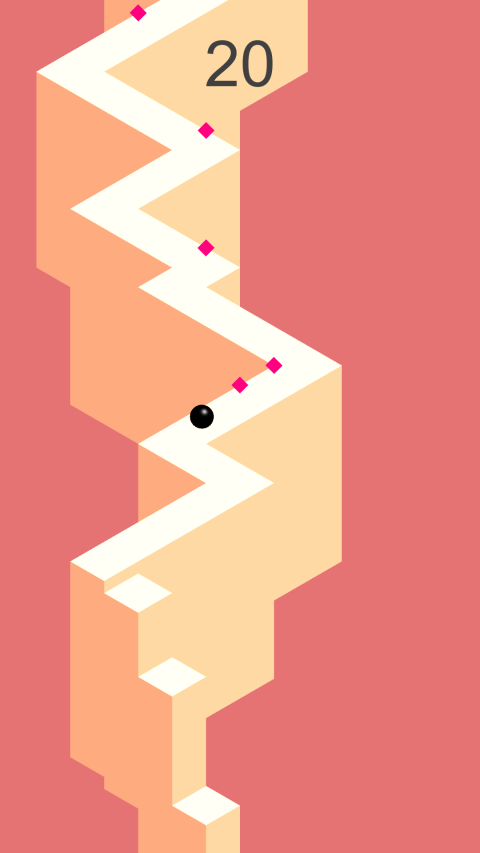

# TapTap Game Template Project
Mobile hyper casual game template for Unity.

## Unity version
[Unity 2019.3.7f1](https://unity3d.com/unity/whats-new/2019.3.7) or newer.

## Description
Tap to change movement direction of the ball. Collect coins for scoring points. Try not to fall off the edges as long as you can.

## Features
- Object Pooling.
- Restart game without reloading scene.
- Update System that provides events like: Update, FixedUpdate, ScreenResolutionChanged, SceneReset, etc.
- Configs that provides ease of editing game balance.

## License
[MIT License](https://choosealicense.com/licenses/mit/).

## Preview

